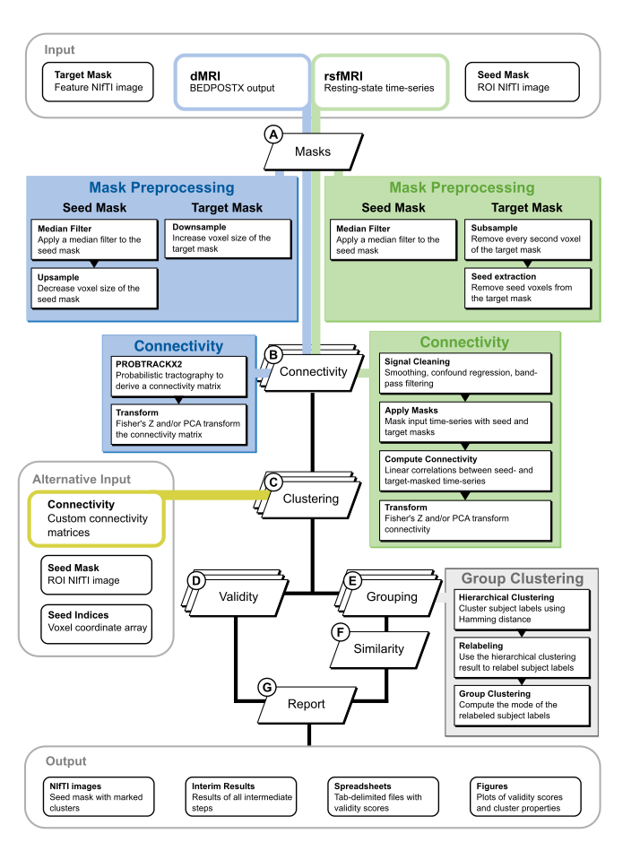

.. _workflow:

========
Workflow
========
In this section the processing of the pipeline is described through its various tasks. For information on how to
provide the input data, `read the input data section <InputData>`_.

**********************
Mask Preprocessing (A)
**********************
Mask preprocessing is the first task of the workflow. Unlike the other steps, it is already performed during the setup
as it is relatively quick. Depending on the parameters given in the `configuration file <_instructions>`_ certain
procedures will be applied to the ROI (seed) and target masks.

First and foremost, the seed mask must be in the same space as the target mask and, for resting-state fMRI data, also
in the same space as the time-series. If a target mask is not defined, a modified FSL (http://www.fmrib.ox.ac.uk/fsl/)
distributed average Montreal Neurological Institute (MNI) 152 T1 whole-brain gray matter group template (2mm isotropic)
will be used as the target. The seed-mask and time-series data must then be in this space.

Now the masks are checked for `binarity`. A mask should consist only of 0 or 1 values, with 1's indicating the location
of a voxel that is to be included in the regional CBP procedure. If this is not the case, the given binarization
threshold is used to set voxels above this threshold to 1, and below or equal to 0. Next, the seed mask is optionally
`median filtered`. This step is commonly skipped and is mostly used for hand-drawn ROIs. The resulting seed mask is then
optionally removed from the target mask. This is done to exclude ROI-to-ROI connectivity, which may dominate the
connectivity profiles and influence the clustering. However, it is unclear whether this step is necessary hence it is
by default not enabled.

For the rsfMRI modality, the target mask is subsampled. This means that only every second voxel in each dimension is
kept under the spatial-smoothness assumption that neighboring voxels provide a relatively similar signal. Subsampling
is only recommended if the data has been smoothed.

For dMRI, the seed mask is upsampled. This upsampling spreads the ROI voxels to cover a larger area (reflecting a
higher resolution for use with PROBTRACKX2), while maintaining the same number of voxels (which is necessary so that
ROI voxels can be mapped back upon the original ROI mask). Thus, voxels within the upsampled ROI are spread
equidistantly over a larger area with no direct neighboring voxels as a result of not increasing their number. The
target mask is optionally downsampled, resulting in fewer voxels covering the same space (i.e., larger voxels). This is
done to reduce computation time for PROBTRACKX2 at minimally loss of specificity.

Lastly, the seed coordinates are extracted from the seed mask in C-contiguous order, resulting in the
seed_coordinates.npy file in the project directory. This is a 2-dimensional array containing the x, y, and z coordinates
of each seed voxel. The indexing order is the same order of the seed voxels in the connectivity matrices generated by
*CBPtools*.

Always manually ensure that the seed_mask.nii.gz, highres_seed_mask.nii.gz and target_mask.nii.gz are as you expect
them to be.

****************
Connectivity (B)
****************
The connectivity task differs between the rsfMRI and dMRI modalities. This is the only part of the workflow where both
modalities differ, as from the clustering onwards all output is treated the same.

Resting-State fMRI
==================
This task will be executed in parallel (if possible), processing multiple subjects at the same time. It is recommended
to set the `--resources io=x` parameter when executing Snakemake to reduce the amount of connectivity jobs that can be
run in parallel if file system latency is an issue.

The time-series of a subject will be loaded and optionally smoothing is applied using the
nibabel.processing.smooth_image function. Next, the seed- and target voxels are taken from the time-series using the
seed- and target masks, respectively. Nuisance signal regression is then optionally applied to the time-series of the
seed- and target voxels, followed by optional band-pass filtering. Band-pass filtering is recommended, but is not a
default setting as the repetition time must manually be entered in the configuration file.

At this point *CBPtools* searchers for low-variance voxels both in the seed and target. If the number of low-variance
voxels exceeds the predefined threshold, then an empty connectivity matrix is instead given as output. This allows the
workflow to continue processing other subjects, and processing is only halted prior to the grouping tasks. Subjects can
then easily be removed or corrected, after which the workflow can be resumed. Note that already processed files do not
need to be processed again.

The correlation between the seed-voxel time-series and target-voxel time-series is now computed and optionally
arctanh transformed (using np.arctanh). Lastly, if the option is set in the configuration file, the principal
component analysis is performed on the connectivity matrix. This helps to reduce the number of features (i.e., the
target voxels) to a lower number of components and may speed up subsequent clustering.

The resulting connectivity matrix is stored either as an uncompressed .npy file, or as a compressed .npz file with the
array being named connectivity.npy.

Diffusion MRI
=============
As for resting-state fMRI, this task will also be executed in parallel (if possible), running multiple instances of
PROBTRACKX2. The `omatrix2` file (called fdt_matrix2.dot) is then densified and optionally cubic transformed
(np.power(connectivity, 1 / 3)). As with the rsfMRI connectivity, principal component analysis can optionally be
applied. Since FSL uses F-contiguous ordering, the order of the seed voxels in the connectivity matrix is reordered as
if C-contiguous ordering were used. This is only performed on the seed voxels, and the target voxels remain in F-order.
For further processing with *CBPtools* their order does not matter.

The resulting connectivity matrix is stored either as an uncompressed .npy file, or as a compressed .npz file with the
array being named connectivity.npy.

Running PROBTRACKX2 and densifying its output are considered two separate tasks in the workflow, although this has no
further bearing on the results.

**************
Clustering (C)
**************
The connectivity matrices are passed to the clustering task. If connectivity matrices are given directly as input, then
this is the initial task. The clustering task is likewise parallelized so that each subject and each clustering
granularity *k* (i.e., the list of requested cluster numbers) can be run simultaneously.

The connectivity matrices are loaded and the k-means algorithm is applied (using sklearn.cluster.KMeans). This results
in a set of labels (solutions) where each seed voxel is assigned to a cluster, for each clustering granularity *k* and
each subject.

************
Validity (D)
************
The requested validity metrics are applied per participant, likewise in paralllel fashion. All clustering solutions of
a given subject (i.e., for each clustering granularity *k*) are processed together. That is, the parallelization is only
across subjects.

The requested validity metrics are each computed per subject using the connectivity matrix as a feature array, and the
predicted labels (solutions) for the participant. Note that for the Silhouette score, the metric for calculating
distance between instances in the feature array is Euclidean.

Once this task is completed for each participant, the resulting scores are merged into a table and used to generate
boxplots for each validity metric and each requested clustering granularity *k*.

************
Grouping (E)
************
All subject clustering solutions are combined into one matrix, sorted by the participant_id order in the participants
file (which is alphanumerically sorted). The pairwise hamming distance (y) is calculated on the matrix (x). Then,
hierarchical clustering is performed on this matrix (z) with the linkage algorithm specified in the configuration file.
The cophenetic correlation is then calculated between z and y. The tree is then cut at the requested cluster number to
obtain a reference clustering.

.. code-block:: python

    y = pdist(x, metric='hamming')
    z = hierarchy.linkage(y, method=linkage, metric='hamming')
    coph = hierarchy.cophenet(z, y)
    group_labels = hierarchy.cut_tree(z, n_clusters=len(np.unique(x)))

This reference clustering can be chosen as the group level cluster solution if so
specified in the configuration file (`method = agglomerative`). However, by default it is only used as a reference for
relabeling the subject clustering solutions (`method = mode`). This relabeling is necessary as the number used for
identifying a cluster may differ between subjects. The relabeling that most matches the reference solution is then kept.

The relabeled solutions are again combined into one matrix, and the mode (np.mode) is taken and used as the group level
solution. Lastly, the group level solution is mapped onto the seed mask for each clustering granularity *k* and stored
as a NIfTI image. This allows the clustering results to be viewed using any NIfTI image viewer.

**************
Similarity (F)
**************
The defined similarity metric is now used to calculate the pairwise similarity between all subject cluster solutions
for each requested clustering granularity *k*, resulting in a similarity matrix. The same similarity metric is then
used to calculate the similarity between each subject's cluster solution and the group level solution for each
clustering granularity *k*.

**********
Report (G)
**********
The pairwise similarity and subject to group solution similarity values are plotted as a heatmap and a boxplot,
respectively. Likewise, the relabeling accuracy obtained from the grouping (E) task as well as the cophenetic
correlation are plotted into a boxplot and pointplot.

The procedure is now complete and both the summary results as well as the interim data can be viewed in the project
folder.