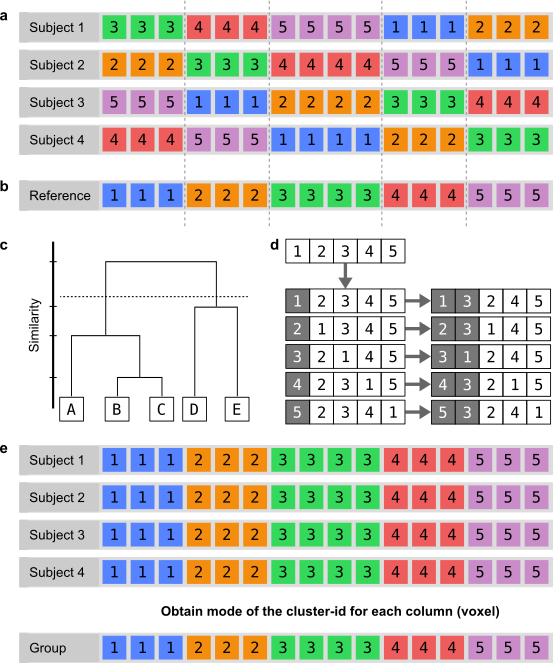

.. |br| raw:: html

     

.. raw:: html

    

.. role:: green

.. _TaskGrouping:

========
Grouping
========
.. glossary::
    Configuration fields
        data.seed_coordinates (connectivity only) |br|
        parameters.clustering.grouping.linkage |br|
        parameters.clustering.grouping.method

    Output
        `group/{n_clusters}clusters/labels.npz` |br|
        `group/{n_clusters}clusters/labeled_roi.nii.gz`

    Logging
        `log/k{n_clusters}.group_level_clustering.log`

    Benchmarking
        `benchmarks/k{n_clusters}.group_level_clustering.log`

All individual participant cluster labels are provided as input to this task.

The k-means clustering algorithm (or, alternatively, the agglomerative or spectral clustering algorithm) from the
previous :ref:`clustering <TaskClustering>` step is performed at the subject level. That is, for each seed voxel by
target voxel connectivity matrix, the cluster labels are obtained per requested *k* number of clusters. This results in
one set of labels per subject, per *k*. The cluster-ids are assigned randomly. To interpret the parcellations over a
population, the parcellations must be combined into a single (group) parcellation per *k* by computing the most
frequent cluster assignment for each ROI voxel across subjects. Since cluster-ids are assigned randomly it is
necessary to relabel the parcellations such that the most similar clusters between subjects get assigned the same
cluster-id. The permutation approach is skipped if the `method` is defined as 'agglomerative', in which case the
hierarchical clustering results are used as a group clustering result.

   **Fig. 1**. Relabeling strategy to obtain group cluster labels. **a** Four example label sets obtained from
   clustering, where each color/number represents a cluster-id that is assigned randomly. Each of the subjects has an
   identical clustering, yet the cluster-ids differ. **b** Reference cluster labels obtained through hierarchical
   clustering of the subject labels in a. **c** Illustration of hierarchical clustering performed on 5 voxels. **d**
   Cluster-ids are swapped for each possible permutation of the cluster-ids array. Each permutation is then tested for
   similarity against the reference clustering from b. **e** The cluster labels for each subject after the relabeling
   strategy has been applied. The mode is obtained for each voxel, resulting in the group clustering

Reference clustering
====================
The reference clustering is obtained by performing hierarchical clustering using the `scipy` package
(`scipy.spatial.distance.pdist` and `scipy.cluster.hierarchy`) with Hamming distance. Hamming distance does not use the
label values (i.e., the assigned cluster-ids), but instead measures the minimum number of substitutions required to
change the set of cluster labels from one subject to that of another.

The pairwise hamming distance (y) is calculated on the matrix (x). Then, hierarchical clustering is performed on this
matrix (z) with the linkage algorithm specified in the configuration file. The cophenetic correlation is then
calculated between z and y. The tree is cut at the requested cluster number to obtain a reference clustering.

.. code-block:: python

    y = pdist(x, metric='hamming')
    z = hierarchy.linkage(y, method=linkage, metric='hamming')
    coph = hierarchy.cophenet(z, y)
    group_labels = hierarchy.cut_tree(z, n_clusters=len(np.unique(x)))

Note that the cophenetic correlation is reported for cluster assessment.

Relabeling
==========
For each participant the cluster labels are relabeled to best match the reference clustering. This is done by permuting
over all different combinations of cluster-id swaps per subject and comparing the swapped labels to a reference
clustering that best represents all of the subjects. Only the most similar permutation is kept and used to reassign
cluster-ids for that subject.

Obtaining the Mode
==================
Once all participant cluster labels have been relabeled to best match the reference clustering, they become comparable.
The most frequent assignment for each voxel is then obtained over the relabeled sets of labels using the mode method of
the `scipy` package (`scipy.stats.mode`).

Mapping the labels onto the ROI
===============================
Using the seed mask and the seed coordinates, the cluster labels are mapped upon the :term:`ROI` for each clustering
granularity *k* using the `cbptools.image.map_labels` method and the `nibabel` package.
