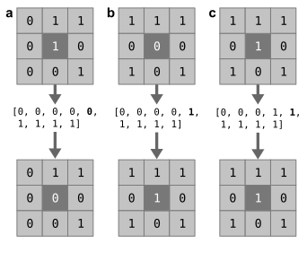

.. |br| raw:: html

     

.. raw:: html

    

.. role:: green

.. _TaskMasking:

=======
Masking
=======
This task will preprocess the seed (:green:`data:masks:seed`) and target masks.

.. note::
    We strongly recommend to manually verify the masks, to ensure that they turn out as expected.

.. glossary::
    Configuration fields
        data.masks.seed |br|
        data.masks.target (optional) |br|
        data.masks.region_id (optional) |br|
        parameters.masking.seed.binarization (optional) |br|
        parameters.masking.seed.median_filtering (optional) |br|
        parameters.masking.seed.upsample_to (optional, dMRI only) |br|
        parameters.masking.target.binarization (optional) |br|
        parameters.masking.target.remove_seed (optional) |br|
        parameters.masking.target.subsampling (optional, rsfMRI only) |br|
        parameters.masking.target.downsample_to (optional, dMRI only)

    Output
        `seed_mask.nii.gz` |br|
        `target_mask.nii.gz` |br|
        `seed_coordinates.npy` |br|
        `highres_seed_mask.nii.gz` (dMRI only)

    Logging
        `log/process_masks_rsfmri.log` (rsfMRI only) |br|
        `log/process_masks_dmri.log` (dMRI only)

    Benchmarking
        `benchmarks/process_masks_rsfmri.log` (rsfMRI only) |br|
        `benchmarks/process_masks_dmri.log` (dMRI only)

Extracting the seed mask from an atlas
--------------------------------------
If a `region_id` (:green:`data:masks:region_id`) is specified, the given seed mask will be treated as an atlas. The
`region_id` can be a singular integer or a list of integers. Each voxel that has a value that occurs in the `region_id`
will be used to create the seed mask. If multiple region IDs are given, a composite mask of all given IDs is generated.

Binarizing the seed mask
------------------------
Next, both seed and target masks are binarized. If no binarization threshold is set, a default threshold of 0 will be
used. Therefore, if the image already is binary nothing will change.

Median filtering the seed mask (optional)
-----------------------------------------
Median filtering is an optional procedure that can be applied to the seed mask. Per voxel the nearest neighbors are
taken (resulting in a 3x3x3 matrix of the selected voxel and its neighbors) and the median value (i.e., the value in
the center of an array when all values in the matrix are flattened and sorted) is then assigned as the new value of the
selected voxel. Fig. 1 shows three examples of this procedure simplified to a 2-dimensional
space. The first example (Fig. 1a) shows a selected voxel that has too few neighbors that are part of the mask. As a
result, the voxel is removed from the mask by having its value set to zero (the median). The second example
(Fig. 1b) instead shows a selected voxel that is not part of the mask, but has many neighbors that are part of it.
The selected voxel is added to the mask by having its value set to one. Lastly, the third example
(Fig. 1c) shows a selected voxel that is part of the mask and has many neighbors that are likewise part of the mask.
Its value remains unchanged, as the median is the same as its original value.

Median filtering has the ability to ‘close’ small holes in a mask, remove single-voxel strands that portrude from the
mask, or smoothen sharp borders. None of the aforementioned features naturally occur in a brain region and are common
artefacts for hand-drawn ROIs. Hence, median filtering may be a useful tool to get rid of these small artifacts.
However, for atlas-derived ROIs it is not a recommended option.

   **Fig. 1**. Median filtering example

Remove seed voxels from target mask (optional)
----------------------------------------------
When choosing this option, all seed voxels will be set to 0 in the target mask. This procedure can also optionally
remove a border around the seed region to reduce the influence of smoothing. Application of this method ensures that
:term:`ROI` to ROI (i.e., within-ROI) connectivity is ignored. Within-ROI connectivity (i.e., the connectivity between
every pair of voxels within the seed mask) tends to be high due to their relative proximity to one another and may
therefore dominate the clustering. Whether doing so leads to better or more biologically relevant parcellation results,
however, is unclear.

Subsampling the target mask (optional, rsfMRI only)
---------------------------------------------------
This option is only available to the rsfMRI modality. This option is recommended when smoothed BOLD time-series are
used. It ensures that only every second voxel in each dimension is kept under the spatial-smoothness assumption that
neighboring voxels provide a relatively similar signal. This can significantly reduce computation time while
preserving most of the information due to spatial smoothness.

Upsample the seed mask (optional, dMRI only)
--------------------------------------------
Important to note is that this is no real upsampling. Instead, this option spreads the seed mask voxels to cover a
larger area (reflecting a higher resolution for use with `probtrackx2`), while maintaining the same number of voxels.
This is necessary so that seed voxels can be mapped back upon the original seed mask. Therefore, voxels within the
upsampled seed mask will be spread out equidistantly over a larger area with no direct neighboring voxels as a result
of not increasing their amount.

This step will create the `highres_seed_mask.nii.gz` in addition to the `seed_mask.nii.gz`.

Downsample the target mask (optional, dMRI only)
------------------------------------------------
The target mask can be downsampled from a higher to a lower resolution, resulting in fewer voxels covering the same
space (i.e., larger voxels) which can reduce computation time for `probtrackx2`.

Creating the seed coordinates file
----------------------------------
The x, y, and z indices (i.e., coordinates in voxel space) are taken from all seed voxels in C-contiguous order. This
results in a 2-dimensional NumPy array (stored as .npy) of shape (n_voxels, 3), where n_voxels refers to the number of
voxels in the seed mask. The indexing order is the same order of the seed voxels in the connectivity matrices generated
by *CBPtools*, and is used for mapping the cluster labels onto the seed mask.
